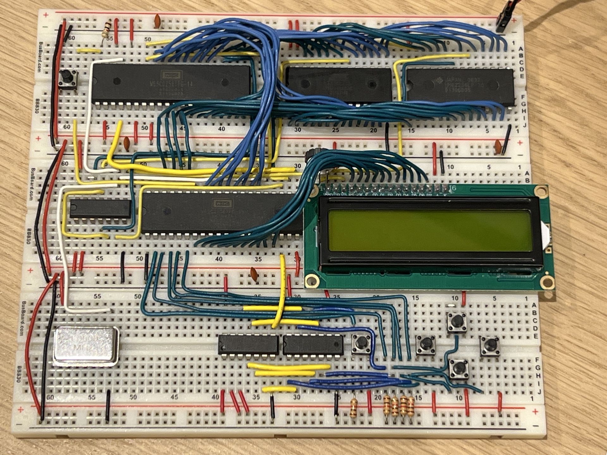

# memory_game

Requirements
- 6502-compatible CPU with program ROM starting at $8000.
- 65C22 VIA mapped at $6000 (PORTB=$6000, PORTA=$6001, DDRB=$6002, DDRA=$6003, PCR=$600C, IFR=$600D, IER=$600E).
- HD44780-compatible LCD in 8-bit mode: data bus on PORTB, control lines on PORTA (RS=PA5, RW=PA6, E=PA7).
- Five active-high buttons wired to PORTA bits: SELECT=PA0, LEFT=PA1, UP=PA2, DOWN=PA3, RIGHT=PA4 (polled).
- LCD character ROM that displays arrow glyphs for codes 0x7F, 0x7E, 0x5E, 0x5F.
- RAM usage: `number` at $0F04-$0F05, `message` at $0350+, `minuend`/`sustraend` at $1000-$1003.

Connection

